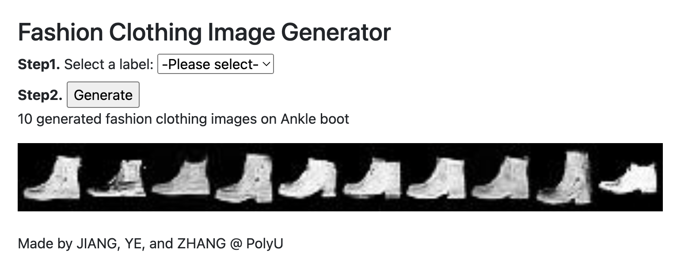
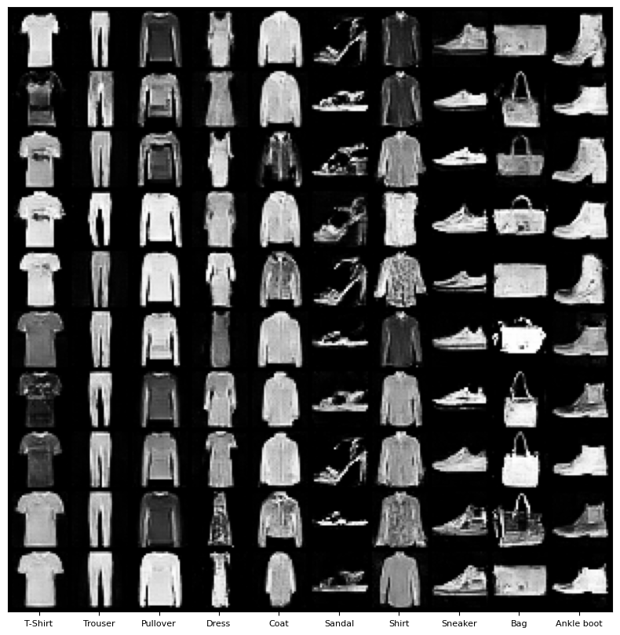
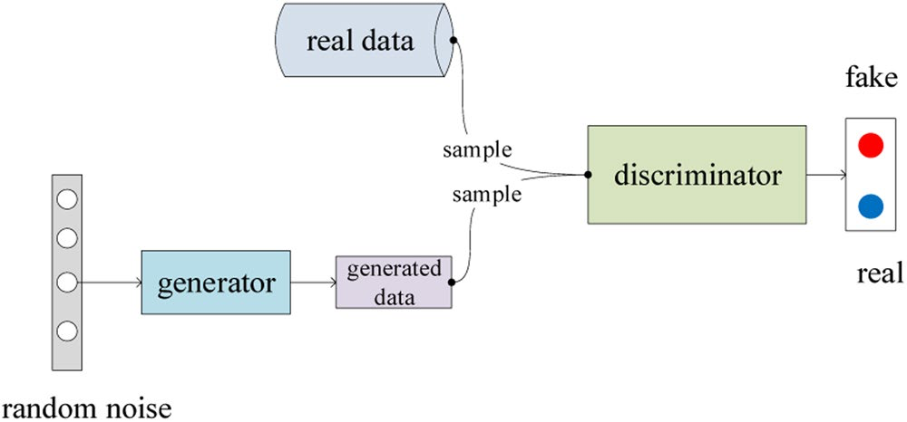
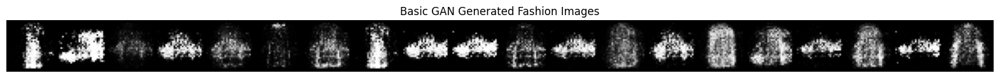
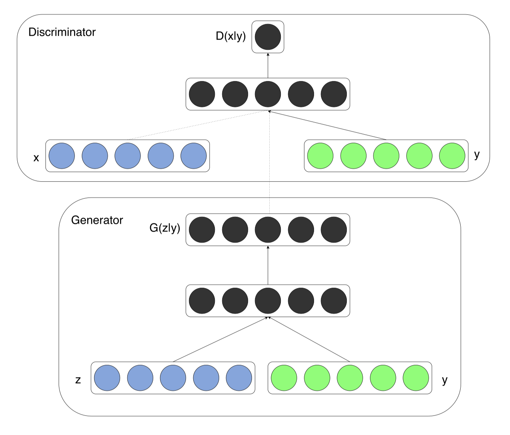
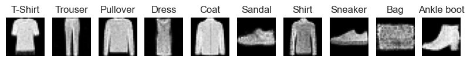
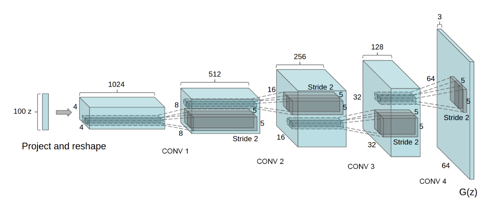
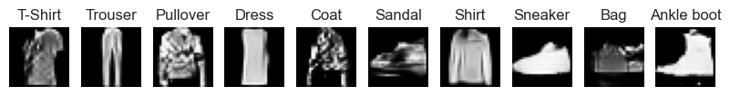
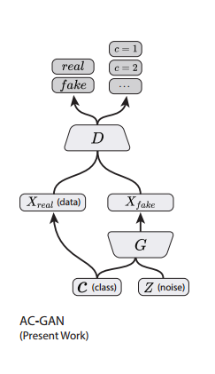
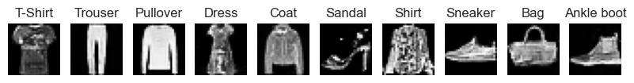

> ***Please carefully read the [Disclaimer of Liability](#disclaimer-of-liability) below first.***  
> All materials in this archive are for reference only. The actual one may vary. 

# Fashion_Image_Generation_Project

Fashion Image Generation Project by Generative Adversarial Networks (GANs) on Fashion MNIST

> *A Group Project of Computer Vision (COMP4423) subject at [The Hong Kong Polytechnic University](https://www.polyu.edu.hk/), made by [JIANG Yiyang](https://github.com/fletcherjiang), [YE Haowen](https://github.com/ShanYu0205), and [ZHANG Wengyu](https://github.com/zhangwengyu999)*

- Web Application on Localhost:

- Generated Fashion Images:

---

## Group Members

- [JIANG Yiyang](https://github.com/fletcherjiang)
- [YE Haowen](https://github.com/ShanYu0205)   
- [ZHANG Wengyu](https://github.com/zhangwengyu999)

---

## Dataset

[Fashion MNIST Dataset](https://www.kaggle.com/datasets/zalando-research/fashionmnist)

---

## Project Models

### 1. Basic GAN

[originalGAN/GAN.ipynb](originalGAN/GAN.ipynb)

---

### 2. Conditional GAN

[cGAN/cGAN.ipynb](cGAN/cGAN.ipynb)

---

### 3. Conditional Deep Convolutional GAN

[cDCGAN/cDCGAN.ipynb](cDCGAN/cDCGAN.ipynb)

---

### 4. Auxiliary Classifier GAN

[ACGAN.ipynb](ACGAN.ipynb)

 (Figure: https://github.com/clvrai/ACGAN-PyTorch)

---

### Comparison

Model | Generated Images
:-: | :-:
GAN | Fashion Images
cGAN | Fashion Images
cDCGAN | Fashion Images
ACGAN | Fashion Images

---

## User Manual

## Preparation

1. Python version: `3.10.10`
2. Make sure following package are install for python3:
   - `OpenCV`, `Flask`, `numpy`, `pandas`, `sklearn`, `torch`, `torchvision`, `torchaudio`, `matplotlib`, `seaborn`, `PIL`
3. Download the [Fashion MNIST Dataset](https://www.kaggle.com/datasets/zalando-research/fashionmnist) and rename `fashion-mnist_test.csv`, and `fashion-mnist_train.csv` as `train.csv`, and `test.csv` respectively, then put two scv files in the newly-created `fashion-mnist` folder under the this folder.

---

### Run and use the Fashion Clothing Image Generator

- Make sure you have installed all the required packages mentioned in the **Preparation** section above; 
- Change directory to the this folder;
- Run the `Fashion_Image_Generator.py` file by
  `python3 Fashion_Image_Generator.py`
- Check your terminal says `Running on http://127.0.0.1:5000/ (Press CTRL+C to quit)`;
- Use your browser to visit the web page on your localhost: [http://127.0.0.1:5000/](http://127.0.0.1:5000/);
- follow the instruction on the web page (step1, step2);
- Press `CTRL+C` in terminal to quit.

---

### How view dataset, train and validate models?

> **Note**: 
> We have tried 4 different models, **original provided GAN**, **Conditional GAN**, **Conditional Deep Convolutional GAN (cDCGAN)**, **Auxiliary Classifier GAN (ACGAN)**. 
> The **ACGAN** model is our final model, which is used in the project.

1. Open the `ACGAN.ipynb` Jupyter Notebook on local machine;
2. In the **first code cell**, please **set proper `device`** according to your machine.
3. Run all cells in the `ACGAN.ipynb` file;
4. You may also try other models which are in the `originalGAN`, `cGAN`, `cDCGAN` folders.

---

## Disclaimer of Liability

**The material and information contained on this website is for general information, reference, and self-learning purposes only. You should not rely upon the material or information on the website as a basis for making any academic, business, legal or any other decisions. You should not copy any material or information on the website into any of your academic, business, legal or any other non-private usages. ZHANG Wengyu will not be responsible for any consequences due to your violations.**

Whilst ZHANG Wengyu endeavours to keep the information up to date and correct, ZHANG Wengyu makes no representations or warranties of any kind, express or implied about the completeness, accuracy, reliability, suitability or availability with respect to the website or the information, products, services or related graphics contained on the website for any purpose. Any reliance you place on such material is therefore strictly at your own risk.

ZHANG Wengyu will not be liable for any false, inaccurate, inappropriate or incomplete information presented on the website.

Although every effort is made to keep the website up and running smoothly, due to the nature of the Internet and the technology involved, ZHANG Wengyu takes no responsibility for and will not be liable for the website being temporarily unavailable due to technical issues (or otherwise) beyond its control or for any loss or damage suffered as a result of the use of or access to, or inability to use or access this website whatsoever.

Certain links in this website will lead to websites which are not under the control of ZHANG Wengyu. When you activate these you will leave ZHANG Wengyu's  website. ZHANG Wengyu has no control over and accepts no liability in respect of materials, products or services available on any website which is not under the control of ZHANG Wengyu.

To the extent not prohibited by law, in no circumstances shall ZHANG Wengyu be liable to you or any other third parties for any loss or damage (including, without limitation, damage for loss of business or loss of profits) arising directly or indirectly from your use of or inability to use, this site or any of the material contained in it.
